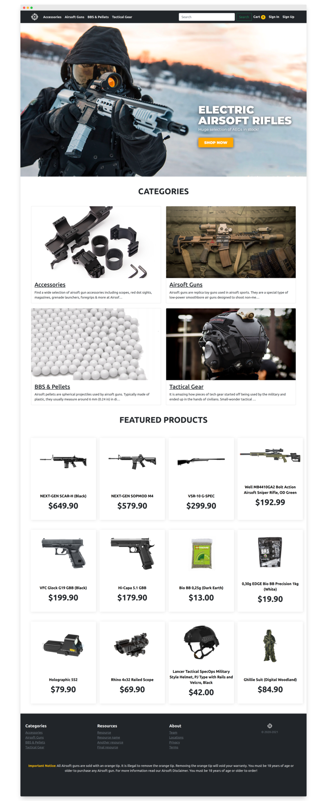
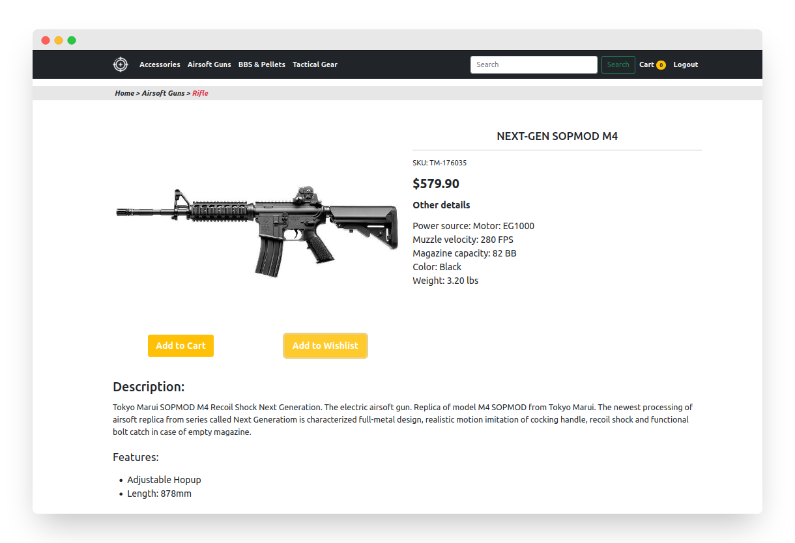
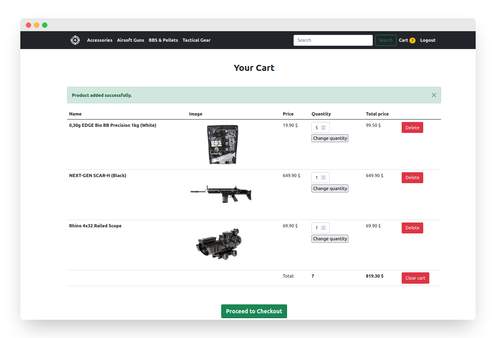
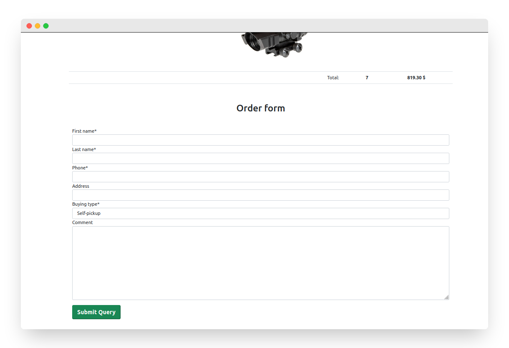

<h1 align="center">Airsoft Shop Website</h1>

This is an **e-commerce website** of airsoft guns and equipment. The project was created for educational purposes. The design of the products models used bad inheritance practices, so the project has stalled. A design idea, products information and images were taken from <a href="https://www.airsoftstation.com/"> AirSoftStation</a>.

   

# Features

* Python 3.6+
* Django 3.2+
* PostgreSQL
* Product Categories (tree structure)
* Cart for Anonymous User (Cookie)
* Search
* Customer
* Authentication (confirmation of registration)
* Edit user information
* Order procedure form
* Modile adaptive design

# Installation

1. [Install PostgreSQL](https://www.postgresql.org/download/) and create new database.

2. Clone or download the repository.
   
3. Create [virtual environment and install requirements](https://packaging.python.org/en/latest/guides/installing-using-pip-and-virtual-environments/) from `requirements.txt`.

   > Note: Ubuntu requires `libpq-dev`, `python-dev` and `build-essential` before installation.

4. Fill `env_sample` file with required data and rename it to `.env`.

5. Make migrations and migrate.

   You can do it mannualy or use a script `scripts/migrations.sh`.

6. Create superuser by running a script `scripts/createsuperuser.py`.

7. Run the server `python manage.py runserver`.

   > Warning: If you get errors try to delete Cookies for `127.0.0.1` and `localhost` in your browser.

8. Load initial data to the website.

   Link to the dataset: [airsoft-shop-dataset-on-mega.zip](https://mega.nz/file/vMwF0CJa#Ep0CvsiQP0_65Nonc5RHTl_onp8jqwLMuxjFdt_MCOg)
   Follow `README.md` instrations inside the archive.

# Screenshots

   
   
   

