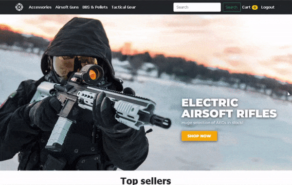

# Airsoft Shop Website

This is an e-commerce website of airsoft guns and equipment.

# Requirements

* Python 3.6+
* Django 3+
* PostgreSQL

# Installation

1. Clone repository.

2. Install PostgreSQL.

3. Install requirements (`requirements.txt`).

4. Fill and rename `.env_sample`.

5. Make migrations.

6. Fill database with initial data in `shop/initial_data`.

   ​	Use command: `manage.py loaddata <file name>`.

   1. `category.json`
   2. `guns.json`

7. Run the server `manage.py runserver`.